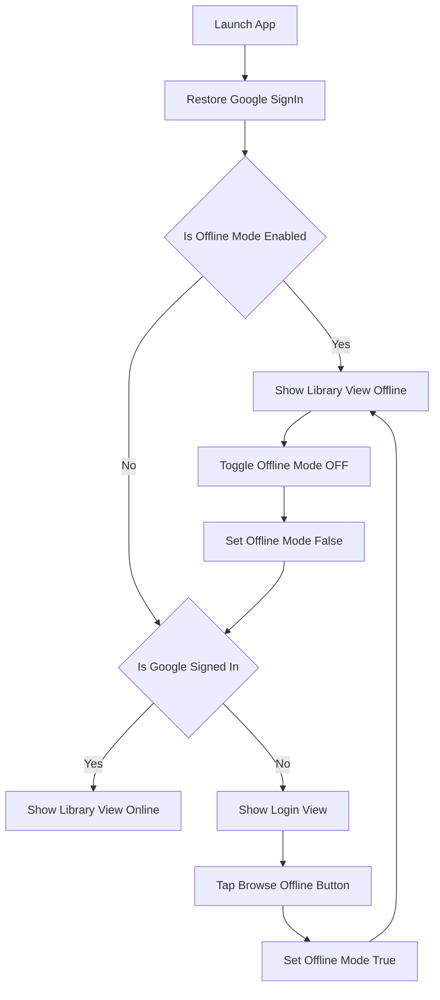

# Technical Design: offline-mode

- **Status**: Draft
- **Created**: 2026-06-09T07:55:18+09:00

---

## 1. Architecture Pattern & Boundary Map

### 設計境界とコミットメント (Boundary Commitments)
- **本スペックが所有するもの (In Boundary)**:
  - アプリケーション全体における「オフラインモード」状態の管理・永続化。
  - ログイン前またはネットワーク未接続時における Google 認証フローのバイパス機能。
  - `LibraryViewModel` 内で `LocalStorageService` からデータを読み出し、`DriveItem` にマッピングして表示する仕組み。
  - オフライン表示時のUI変更（バッジ表示、ダウンロード機能の非活性化）。
- **本スペックが所有しないもの (Out of Boundary)**:
  - `LocalStorageService` のローカル保存ディレクトリパスの変更やメタデータ構造のスキーマ変更。
  - 通信状態の自動監視 (`NWPathMonitor` 等を用いたリアルタイム検知と動的切り替え)。
  - `LocalComicSource` 自体の内部画像読み込みロジックの修正。

### 依存関係方針 (Dependency Direction)
本機能の実装は、以下の依存方向を厳格に順守します。
`Models (DriveItem, LocalComic) -> Services (LocalStorageService) -> ViewModels (AuthViewModel, LibraryViewModel) -> Views (ContentView, LoginView, LibraryView)`
上位レイヤー（Views）から下位レイヤー（Models/Services）への直接的な依存は避け、ViewModelを介して状態を操作します。

### アーキテクチャ図 (Mermaid)


---

## 2. Technology Stack & Alignment

本機能で使用する技術スタックは、プロジェクト定義（`tech.md`）および既存環境に完全に準拠します。新たな外部ライブラリの追加はありません。

- **iOS SDK**: iOS 17.0+
- **Language**: Swift 5.9+
- **UI Framework**: SwiftUI
- **State Management**: `@Observable` (SwiftUI 5 / iOS 17+ 標準機能)
- **Storage**: `UserDefaults.standard` (オフライン設定の簡易永続化用)

---

## 3. Components & Interface Contracts

### 3.1 AuthViewModel (Extension)
`AuthViewModel` にオフラインモードの状態管理を統合します。

```swift
extension AuthViewModel {
    // MARK: - Properties
    
    /// オフラインモードの状態 (UserDefaultsに永続化)
    var isOfflineMode: Bool { get set }
    
    // MARK: - Methods
    
    /// オフラインモードを手動で切り替える
    /// - Parameter enabled: trueでオフラインモード有効化
    func setOfflineMode(_ enabled: Bool)
}
```
*実装ノート*: `isOfflineMode` のゲッターとセッターは `UserDefaults.standard` に `isOfflineMode` キーで値を読み書きし、`@Observable` の通知機能を通じて SwiftUI の View に即座に状態変更を伝播させます。

### 3.2 DriveItem (Extension)
`LocalComic` を `DriveItem` にマッピングするためのイニシャライザを定義します。

```swift
extension DriveItem {
    /// LocalComicからDriveItemオブジェクトを生成するマッピングイニシャライザ
    /// - Parameter localComic: ダウンロード済みの漫画データ
    init(from localComic: LocalComic) {
        self.id = localComic.driveFileId
        self.name = localComic.title
        self.mimeType = "application/zip" // 一括アーカイブを模倣
        self.size = localComic.originalFileSize
        self.thumbnailURL = localComic.imagePaths.first // ローカルの絶対URLをサムネイルとして使用
        self.parentId = nil
        self.createdTime = localComic.downloadedAt
        self.modifiedTime = localComic.lastReadAt
        self.width = nil
        self.height = nil
    }
}
```

### 3.3 LibraryViewModel (Modification)
`LibraryViewModel` 内でオフラインモードを監視し、ファイル読み込み処理を分岐させます。

```swift
final class LibraryViewModel {
    // ... 既存のプロパティ ...
    
    /// オフラインモードが有効かどうかを外部から注入または参照する
    var isOfflineMode: Bool = false
    
    /// ファイル一覧を読み込み (既存メソッドの修正)
    func loadFiles() async {
        refreshDownloadedComics()
        folderThumbnails.removeAll()
        isLoading = true
        errorMessage = nil
        
        if isOfflineMode {
            // オフライン時のローカルファイル読み込み
            let localComics = (try? LocalStorageService.shared.loadComics()) ?? []
            self.items = localComics
                .filter { $0.status == .completed }
                .map { DriveItem(from: $0) }
            updateFilteredItems()
            self.nextPageToken = nil // ページネーション無効化
            self.isLoading = false
            return
        }
        
        // ... 既存のGoogle Drive API呼び出し処理 ...
    }
}
```

---

## 4. Data Models & Flow

### データ永続化スキーマ
`UserDefaults` に保存されるデータ:
- キー: `"is_offline_mode"`
- 型: `Bool`
- 初期値: `false`

### シーケンスフロー (手動オフライン切替)
1. ユーザーが `LibraryView` のナビゲーションメニューで「オフラインモード」トグルをONにする。
2. Viewから `authViewModel.isOfflineMode = true` に設定される。
3. `UserDefaults` に値が保存される。
4. `LibraryView` 内の `onChange` トリガーにより、`libraryViewModel.isOfflineMode = true` が設定され、`libraryViewModel.loadFiles()` が非同期実行される。
5. Google Drive APIを呼び出さずに、`LocalStorageService` から読み取られたローカルのダウンロード済みリストに差し替えられ、画面がリフレッシュされる。

---

## 5. Security & Performance

### セキュリティ
- オフラインモード時には Google Drive API へのアクセス・ネットワーク通信を一切行わないため、トークン漏洩や通信傍受のリスクが完全に排除されます。
- クライアントID等の機密情報は引き続き `Secrets.xcconfig` に封じ込められ、変更はありません。

### パフォーマンス
- **API通信のゼロ化**: オフラインモード中、Google Drive API を叩かないため、電波状況が悪い場所でも画面ロードが瞬時に（100ms未満で）完了します。
- **サムネイル読込効率化**: `KFImage` に渡される URL はローカルの画像パス（`file:///` 形式）となり、ネットワークを介さず直接ストレージからキャッシュ読み込みされるため、表示遅延が極小化されます。

---

## 6. Mapping to Requirements

| Requirement ID | 機能概要 | 実装予定コンポーネント | インターフェース / 契約 | 該当ファイル |
| :--- | :--- | :--- | :--- | :--- |
| **1.1** | 手動切り替え | `AuthViewModel`, `LibraryView` | `authViewModel.isOfflineMode` トグルバインディング | `AuthViewModel.swift`, `LibraryView.swift` |
| **1.2** | 設定の永続化 | `AuthViewModel` | `UserDefaults` への自動セーブ/ロード | `AuthViewModel.swift` |
| **1.3** | 状態インジケータ | `LibraryView` | SwiftUI 条件付き描画 (`if isOfflineMode`) | `LibraryView.swift` |
| **2.1** | ローカル漫画のみ表示 | `LibraryViewModel` | `loadFiles()` 内でのローカル分岐とマッピング | `LibraryViewModel.swift` |
| **2.2** | 未ダウンロード非表示 | `LibraryViewModel` | `status == .completed` のフィルタ適用 | `LibraryViewModel.swift` |
| **3.1** | ダウンロード済み閲覧 | `LibraryView`, `LocalComicSource` | `handleItemTap` でのリーダー起動 | `LibraryView.swift`, `ComicSource.swift` |
| **3.2** | 未ダウンロード閲覧制限 | `LibraryView` | 未ダウンロード漫画のボタン非活性化または非表示 | `LibraryView.swift` |
| **3.3** | 新規ダウンロード無効化 | `LibraryView` | ダウンロードUI要素の条件付き無効化・非表示 | `LibraryView.swift` |

---

## 7. File Structure Plan

本機能の実装にあたり、以下のファイルを新規作成または修正します。

| ファイルパス | 変更区分 | 変更責任 (Responsibility) |
| :--- | :--- | :--- |
| `GD-MangaReader/GD-MangaReader/ViewModels/AuthViewModel.swift` | 修正 | `isOfflineMode` フラグの定義と `UserDefaults` を用いた永続化ロジックの追加。 |
| `GD-MangaReader/GD-MangaReader/Models/DriveItem.swift` | 修正 | `LocalComic` を `DriveItem` に変換する `init(from localComic:)` の追加。 |
| `GD-MangaReader/GD-MangaReader/ViewModels/LibraryViewModel.swift` | 修正 | `isOfflineMode` に応じた `loadFiles()` の分岐と、ローカルからのデータ展開・マッピング。 |
| `GD-MangaReader/GD-MangaReader/App/GD_MangaReaderApp.swift` | 修正 | `ContentView` における `isOfflineMode` 時の認証バイパスルーティングの実装。 |
| `GD-MangaReader/GD-MangaReader/Views/LoginView.swift` | 修正 | 完全オフライン時でもライブラリに進めるよう、「オフラインで利用」ボタンを追加。 |
| `GD-MangaReader/GD-MangaReader/Views/LibraryView.swift` | 修正 | オフライン状態を示すヘッダーインジケータ、トグルスイッチの追加、およびオフライン時のダウンロード操作制御。 |

---

## 8. Testing Strategy

### 8.1 ユニットテスト（ViewModel検証）
- **`AuthViewModelTests`**:
  - `isOfflineMode` の値を切り替えた際、正しく `UserDefaults` に保存・取得されることの検証。
- **`LibraryViewModelTests`**:
  - `isOfflineMode = true` の状態で `loadFiles()` を実行した際、`DriveService` が呼び出されず、`LocalStorageService.shared` から取得したデータのみが `items` に設定されることの検証。
  - `nextPageToken` が `nil` になり、ページネーションが発生しないことの検証。

### 8.2 統合・E2Eテスト（ユーザーフロー検証）
- **フロー1: 完全オフライン起動 (1.2, 2.1)**
  - 通信を切断した状態でアプリを起動し、ログイン画面で「オフラインモードで利用」をタップすると、サインインを要求されずローカルライブラリ画面に遷移し、ダウンロード済みの漫画のみが表示されること。
- **フロー2: ライブラリ画面でのオン/オフ切り替え (1.1, 1.3, 2.2, 3.3)**
  - ライブラリ画面でオフライントグルをONにすると、Google Driveから取得した未ダウンロードアイテムが即座に消え、ダウンロード済みアイテムのみが表示されること。
  - トグルがONの際、「オフライン」表示バッジが表示され、ダウンロード関連ボタン（一括ダウンロード等）が非表示または無効化されること。
