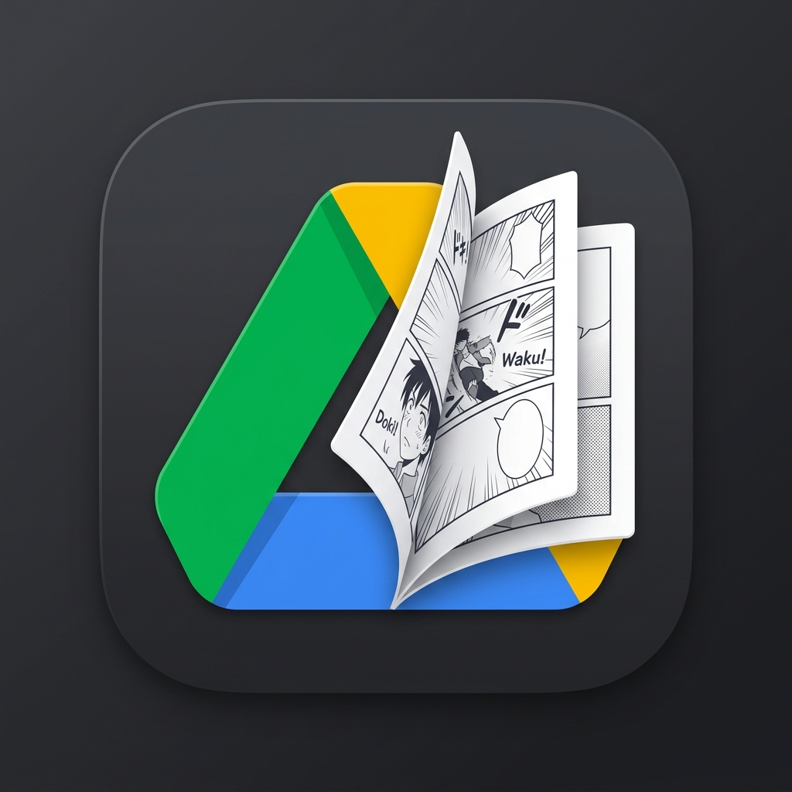

# GD-MangaReader

<p align="center">
  
</p>

<p align="center">
  
  
  
  <a href="https://github.com/manyo/google-drive-manga-reader/actions/workflows/ios.yml">
    
  </a>
  <a href="https://coderabbit.ai">
    
  </a>
</p>

---

## 概要 (Overview)

**GD-MangaReader** は、Google Drive上にあるZIP/RAR/CBZ/CBR形式のコミックアーカイブや画像フォルダを、iOSデバイス（iPhone / iPad）にダウンロードして快適に読むための高機能マンガビューアーアプリです。

**GD-MangaReader** is a high-performance iOS manga/comic viewer app designed to browse, download, and read ZIP, RAR, CBZ, CBR archives, or raw image folders directly from your Google Drive on iPhone and iPad.

---

## 主な機能 (Features)

### 📂 Google Drive 連携 & ブラウジング
*   **OAuth認証**: 安全な Google Sign-In による認証。
*   **ファイルブラウザ**: マイドライブ内のフォルダやファイルをアプリ内でシームレスにブラウズ。Grid / List 表示の切り替えに対応。

### 📦 多彩なフォーマットへの対応
*   **アーカイブ形式**: `.zip`, `.rar`, `.cbz`, `.cbr` をサポート。
*   **画像ストリーミング**: アーカイブ化されていない画像フォルダ (`.jpg`, `.jpeg`, `.png`, `.heic`) の閲覧にも対応。

### 📥 オフライン閲覧（ダウンロード & 解凍）
*   **一括ダウンロード**: ZIP/RAR/CBZ 等をローカルのドキュメントフォルダへ一括ダウンロード・展開。
*   **シリーズダウンロード**: フォルダ単位（シリーズ全体）の一括ダウンロードに対応。
*   **バックグラウンド処理**: ダウンロードの進捗状況をプログレスバーでリアルタイム表示。

### 📖 高機能ビューアー (Manga Reader)
*   **柔軟な読書方向**: 横読み（日本式・右から左 / アメコミ式・左から右）および縦スクロール読み（縦読み）に対応。
*   **見開き表示**: iPadやiPhone横向き時に自動的に「見開き（2ページ）表示」に切り替え。
*   **ピンチズーム**: 滑らかなピンチイン・ピンチアウト操作による画像拡大縮小。
*   **レジューム機能**: 読書中のページプログレスを自動保存し、いつでも続きから再開可能。

---

## プロジェクト構造 (Directory Structure)

```text
GD-MangaReader/
├── App/             # アプリのライフサイクル、エントリーポイント
├── Models/          # データモデル（Book, Page, DriveFile等）
├── Modifiers/       # SwiftUIカスタムビューモディファイア
├── Resources/       # アセット、ローカライズ、Secrets.xcconfig
├── Services/        # Google Drive API, 認証, ダウンロード、解凍処理
├── ViewModels/      # 各画面のビジネスロジック
└── Views/           # SwiftUIビュー（MangaReader, FileBrowser等）
```

---

## 環境要件 (Requirements)

*   **開発環境 (Development OS):** macOS 14+ (Sonoma以上)
*   **実行環境 (Deployment Target):** iOS 17.0+ / iPadOS 17.0+
*   **IDE:** Xcode 15 / 16+
*   **ツール:** [XcodeGen](https://github.com/yonaskolb/XcodeGen) (プロジェクトファイルの生成に必要)

---

## 使用している外部ライブラリ (Dependencies)

*   [GoogleSignIn-iOS](https://github.com/google/GoogleSignIn-iOS) - Google OAuth 認証
*   [GoogleAPIClientForREST](https://github.com/google/google-api-objectivec-client-for-rest) - Google Drive API 連携
*   [ZIPFoundation](https://github.com/weichsel/ZIPFoundation) - アーカイブ（ZIP/CBZ）の解凍処理
*   [Kingfisher](https://github.com/onevcat/Kingfisher) - 画像の非同期読み込み・キャッシュ管理

---

## セットアップ手順 (Setup Instructions)

本プロジェクトは **XcodeGen** を使用して `*.xcodeproj` ファイルを動的に生成します。また、Google Sign-In用の認証情報はセキュリティ上リポジトリに含まれていないため、ローカルでの設定が必要です。

### 1. Google Cloud Console で Oauth クライアント ID を取得
1. [Google Cloud Console](https://console.cloud.google.com/) にアクセスし、プロジェクトを作成します。
2. 「APIとサービス」 > 「ライブラリ」から **Google Drive API** を有効化します。
3. 「認証情報」から「OAuth クライアント ID」を作成（アプリケーションの種類: **iOS**）し、**Client ID** をコピーします。
   * *(例: `000000000000-dummyid.apps.googleusercontent.com`)*

### 2. `Secrets.xcconfig` の作成
プロジェクト内に `GD-MangaReader/Secrets.xcconfig` ファイルを作成し、以下のフォーマットで記述します。
*(このファイルは `.gitignore` に含まれており、コミットされません)*

```text
// GD-MangaReader/Secrets.xcconfig
// ※ .apps.googleusercontent.com のサフィックスは除外してください
GID_CLIENT_ID = 000000000000-dummyid

// ※ 上記IDを「com.googleusercontent.apps.」に繋げたもの
GID_REVERSED_CLIENT_ID = com.googleusercontent.apps.000000000000-dummyid
```

### 3. プロジェクトの生成とビルド
ターミナルを開き、以下のコマンドを実行します。

```bash
# XcodeGen のインストール（未インストールの場合）
brew install xcodegen

# GD-MangaReader のプロジェクトディレクトリに移動
cd GD-MangaReader

# プロジェクトファイルの生成
xcodegen generate
```

成功すると `GD-MangaReader.xcodeproj` が生成されます。Xcodeで開き、ビルド・実行を行ってください。

---

## トラブルシューティング

*   **"Oauth client was not found" というエラーが出てログインできない場合:**
    `Secrets.xcconfig` の `GID_CLIENT_ID` や `GID_REVERSED_CLIENT_ID` が正しく設定されていません。値を修正後、もう一度 `xcodegen generate` を実行し、Xcode 上で **Product > Clean Build Folder** (`Cmd + Shift + K`) を行ってから再ビルドしてください。
*   **シミュレータでGoogleログイン画面が表示されたあと真っ白になる場合:**
    Xcode 16 + iOS 18 環境などで発生するWebViewのバグの可能性があります。シミュレータの再起動や、ターゲットOSの変更をお試しください。

---

## ライセンス (License)

本プロジェクトは個人利用のみを目的としており、商用利用や無断転載・再配布は禁止されています。詳細については [LICENSE](LICENSE) ファイルをご参照ください。

This project is licensed under a proprietary license for personal, non-commercial use only. See the [LICENSE](LICENSE) file for details.